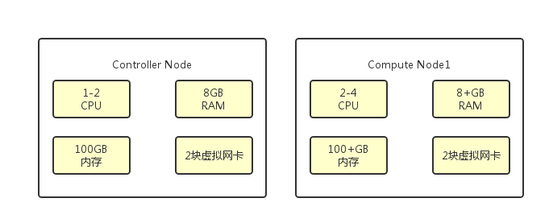
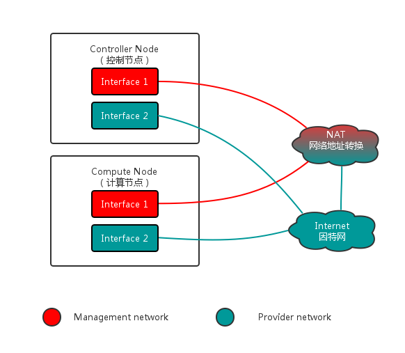

# OpenStack部署规划
OpenStack是一个云操作系统，它通过数据中心控制着计算、存储和网络资源的大池。OpenStack是一套开源项目的综合，它允许企业或服务提供者建立、运行自己的云计算和存储设施。以下给出部署一个云平台所需的基础运行环境需求及服务。

## 运行环境

### 硬件

#### 硬件需求
在部署OpenStack时，所有服务的正常运行都有一定的硬件基础作为支持条件。其中至少用到两个节点（主机）来启动一个实例，即控制节点和计算节点。其他的服务，如块存储、对象存储，则需要额外的节点来部署。对于所选取的硬件配置条件需要达到一定的要求，以下给出最低配置的硬件需求。当然，随着配置的提高，性能也会更优，但是绝对不能低于以下配置，否则会出现一系列问题。为了达到最佳性能，我们建议用户的环境符合或超过以下给出的硬件要求：

* 控制节点：1-2个CPU、8GB RAM、100GB 存储、2块网卡    
* 计算节点：2-4+的CPU、8+GB RAM、100+GB 存储、2块网卡  

#### 硬件描述

##### 控制节点硬件配置
由于控制节点负责运行OpenStack环境所需的管理软件服务，故对于其CPU处理响应的速度有一定的要求。但是1-2个CPU即可满足需求。可能随着CPU数量的增加，其响应时间会有一定的降低，性能也会更加优化。当CPU的选择低于最低配置时，可能出现的问题很多，如创建一个虚拟机所需的时间太久，因此造成虚拟机创建失败等问题。当问题出现时，我们可以通过查询日志的报告，找出问题出现的地方并进行相关修复操作。
该控制节点需要至少两个网络接口。

##### 计算节点硬件配置
计算节点

### 安全
安全是每个软件都会考虑的问题，OpenStack服务提供多种安全措施，如密码、机制、以及加密等以保证各种服务的安全运行。此外，其他支撑服务包括数据库服务和消息中介支持，它们至少可以提供密码设置来保证其安全性。  
为了保证每个服务的独立性及其安全性，我们在进行任何配置时都会设置安全密码，如Database password是根用户用来访问数据库时的密码，ADMIN_PASS是普通用户用来访问的密码等等。OpenStack及其支撑服务的安装和配置需要管理员权限，以确保管理员与用户权限的隔离，从而达到对服务安全的保证。
 * 数据安全：随着大量数据在“云”端的存储，对于数据安全性的关注必不可少。OpenStack通过强加密及密钥管理来保证数据的安全可靠。Keystone通过引入令牌机制（token）来管理用户对资源的访问，同时引入了PKI（Public Key Infrastructure，公钥基础设施）对令牌加以保护。    
* 身份和访问管理安全：为了有效控制云计算中的用户和服务认证，需要合理定义系统管理人员的控制边界，以防来自内部的攻击所造成的危害。Keystone中通过Policy（访问规则）来做到基于用户角色的访问控制。  
  * 虚拟化安全：创建虚拟机是OpenStack中常见的操作之一，如何保证创建的各个虚机之间的独立性以及隔离性，是虚拟化安全需要考虑的问题。在保证隔离的同时，如何使得不同敏感程度和安全要求的虚拟机能够共存也是问题之一。  
  * 基础设施安全：基础设施安全包括服务器、存储、网络等核心IT基础设施的安全。

### 主机网络
在主机的系统配置设置好后，要对所有节点进行网络设置。在部署服务过程中，会涉及到软件的安装包下载、安全更新、DNS（Domain Name System，域名系统）、NTP（Network Time Protocol，网络时间协议）等等管理工作，便需要网络的参与。大多数情况下，这些节点需要通过管理网络来实现互联网访问。此管理网络配置再第一块网卡上，命名为eth0。
第二块网卡eth1，这里设置为供应商网络，它使用可路由的IP地址空间，并假定物理网络的基础设施提供直接的互联网访问。在供应商网络中，所有的实例都直接附加在供应商网络中。该网络需要配置网关。

### NTP网络时间协议
NTP网络时间协议，通过通信保持时钟主机或节点正确使用可信的，准确的时间源的方法。通过履行时间协议，从而使各节点之间的服务同步。我们建议通过配置控制器节点来引用更精确的服务器，而其他节点则引用控制器节点。默认情况下，控制节点通过公有服务器池来同步时间。

### SQL数据库
大多数OpenStack服务将信息存储在SQL数据库中，如存储每个服务的状态和配置信息，它通常跑在控制节点上。MySQL在OpenStack的环境中被当作所有数据库的后端。

### 消息队列
OpenStack使用消息队列（Message Queue）来整合各项服务之间的操作和状态信息，通常运行在控制节点。OpenStack可以支持几种消息列服务，如RabbitMQ、Qpid和ZeroMQ。但是RabbitMQ是最为常用的，大多数OpenStack的发行版都支持该服务。

### Memcached
Memcached是用来存储身份认证服务的令牌的，在产品部署中，我们建议启用防火墙、认证和加密的组合来保护它。它是OpenStack组件用来高速缓存数据和提高性能的快速内存键值缓存软件。Memcached运行在所有的控制节点上，以保证当一个一个实例出现故障时，其它实例仍然可用。

## 服务

### 控制节点及其服务

控制节点上运行着一系列的服务，如身份认证服、镜像服务、计算的管理部分、网络的管理部分、各种网络代理，以及仪表盘。它也支持一些其他的服务，如SQL数据库、消息队列以及网络定时协议。该节点具有以下特点：

* 为用户或者在OpenStack环境中交流的其他组件的API服务提供入口；
* 提供高可用的“基础设施”服务，如MySQL，Qpid，来巩固所有的支持其他的服务；
* 通过在其他的主机上运行的服务，提供一种所谓的永久存储，以实现可靠性，该永久存储会备份到存储节点。
该控制节点需要至少两个网络接口。

#### Identity（Keystone）
身份认证服务Keystone运行在控制节点上，确保在其他节点出现故障时，至少一个实例可用。Keystone为OpenStack的其他服务提供认证和授权服务。主要负责OpenStack用户的身份认证、令牌管理、提供访问资源的服务目录，以及基于用户角色的访问控制。在安装OpenStack时，它是一项必不可少的服务，如果没有它，我们对OpenStack的操作便会变得混乱而没有规章限制，那样对资源的操作和管理便会不受控，进而使得我们的使用环境变得不可靠，故Keystone在OpenStack中起着不可替代的作用。

#### Compute（Nova）
计算服务部件Nova运行在控制节点上，但是仅部分组件安装在控制节点。如nova-api、scheduler（调度器）、objecstore、cert、consoleauth、conductor和vncproxy等服务。  
Nova-api是访问并使用nova所提供的各种服务的唯一途径，作为客户端和nova之间的中间层，nova-api扮演了一个桥梁或者中间人的角色。Nova-api把客户端的请求传达给nova，待nova处理完请求后再将结果返回给客户端。  
scheduler是用来裁决虚拟机的生存空间与资源分配的部件，即判断是否有一个主机能够容纳新的虚拟机，它会通过各种规则，考虑包括内存使用率、CPU负载等多种生存因素为虚拟机选择一个合适的主机。通过scheduler分配后得到的主机比随机分配得来的主机更可靠，更合理。

#### Networking（Neutron）
网络服务部件Neutron运行在控制节点上.其中neutron-server作为neutron中的唯一一个服务进程，它承担着接收用户RESTful API请求并分发处理的任务。

#### Dashboard（Horizon）
仪表盘服务部件Horizon运行在控制节点上，它的存在主要是为了方便最终的用户和开发者，让他们能够浏览并操作属于自己的计算资源。

### 计算节点
计算节点主要运行的是计算实例的Hypervisor部分。默认情况下，计算服务使用KVM Hypervisor。计算节点也运行一种网络服务的代理，该代理将实例连接到虚拟网络，并且通过安全组为实例提供防火墙服务。
部署时不限于一个计算节点，但是每个节点至少需要两个网络接口。

#### Compute（Nova）
如上所述，nova中的部分服务是安装在控制节点的，而另外一部分服务是装在计算节点，如nova-compute、nova-conductor。该组件只需运行在计算节点，一旦该计算节点启动，便会在该节点上运行所需的服务。装在计算节点的组件主要是控制管理虚拟机的状态。虚拟机的状态可以用三个字段描述，power_state，vm_state以及task_state。

#### Networking（Neutron）
Neutron一开始并没有作为OpenStack的核心项目进入人们的视野，它是由OpenStack的nova-network服务演变而来。它的提出是为了给我们提供更为丰富的网络拓扑结构，支持更多的网络类型，使我们的服务具有更好的可扩展性。

**什么时候用到neutron**  

* 需要一个覆盖网络解决方案。OpenStack Networking支持GRE（Generic Routing Encapsulation，通用路由封装）和VXLAN隧道来隔离虚拟机流量。在网络结构中不需要有VLAN配置，来自物理网络的唯一要求是要提供节点之间的IP连接；
* 需要在租户之间有overlap IP。OpenStack使用Linux内核的网络命名空间能力，它允许不同的租户使用相同的子网范围，如192.168.100/24，在相同的计算节点上无任何重叠或干涉的风险，建议在大型多租户部署时使用，相比之下，nova networking仅支持flat拓扑；
* 需要Red Hat-certified third-party OpenStack Networking plug-in。开源ML2核心插件与ovs驱动机制，基于物理结构和其他网络的需求，third-party OpenStack Networking插件可替代默认的ML2/ovs来部署；
* 需要VPNaas、FWaas或者LBaas。只在Neutron中，不在nova-network中有dashboard可允许租户来管理他们的服务不通过管理员的干预。

**什么时候用到nova-network**

* 部署中需要flat或VLAN网络，这种部署意味着可伸缩性的需求；
* 在租户之间不需要overlap IP地址，通常建议在小型私人的部署中使用；
* 不需要SDN的场景时，或与物理网络交互的能力；
* 不需要私有网络服务VPN、firewall和负载均衡服务。

##### 网络基础

###### 网卡
网卡也称网络接口控制器、网络适配器、局域网接收器，是一块被设计用来允许计算机在网络上进行通讯的计算机硬件。由于其拥有MAC地址，所以它属于OSI模型中的L1，它使得用户可以通过电缆或无线相连。每一个网卡都有一个被称为MAC地址的独一无二的48位串行号，它被写在网卡上的ROM中。
网卡的作用：

1. 数据的封装与解封：发送时将上一层交下来的数据加上首部和尾部，成为以太网的帧，接收时将以太网的帧剥去首部和尾部，然后交送上一层；
2. 链路管理：主要是CSMA/CD协议的实现；
3. 编码与译码。

###### 子网

###### 网关
###### 交换机
###### 路由器
###### VLAN
###### 防火墙
###### VLAN

