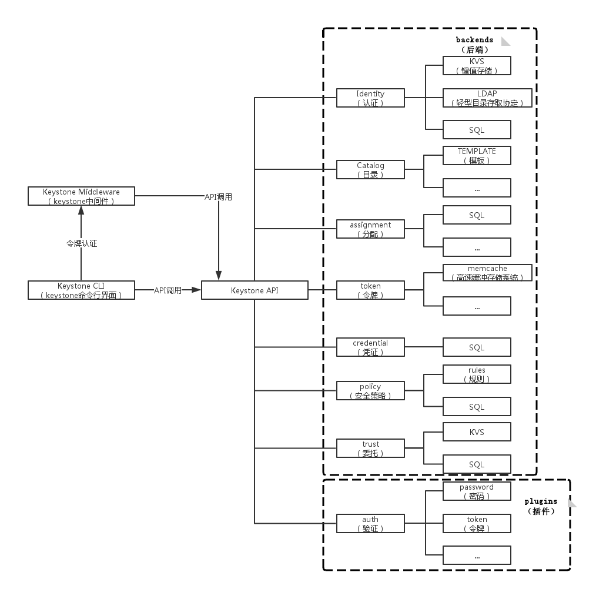
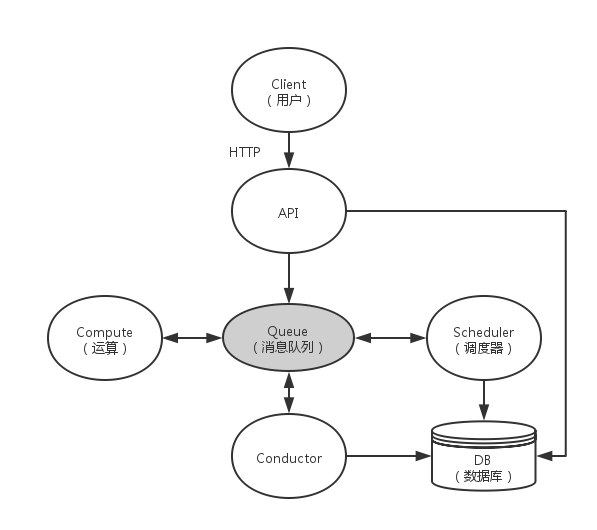
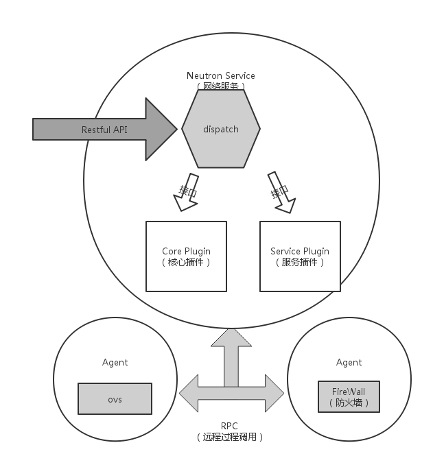
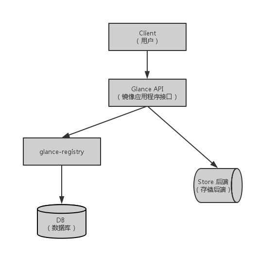
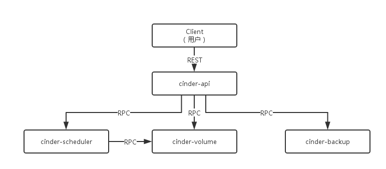
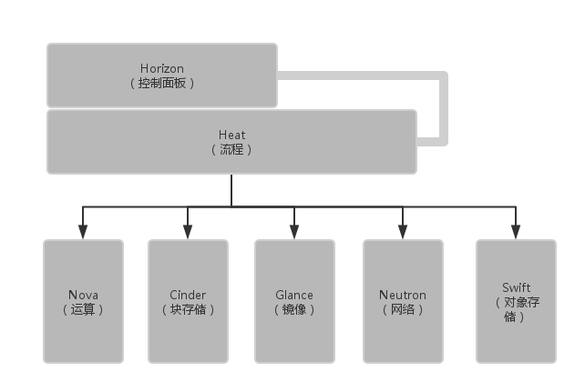
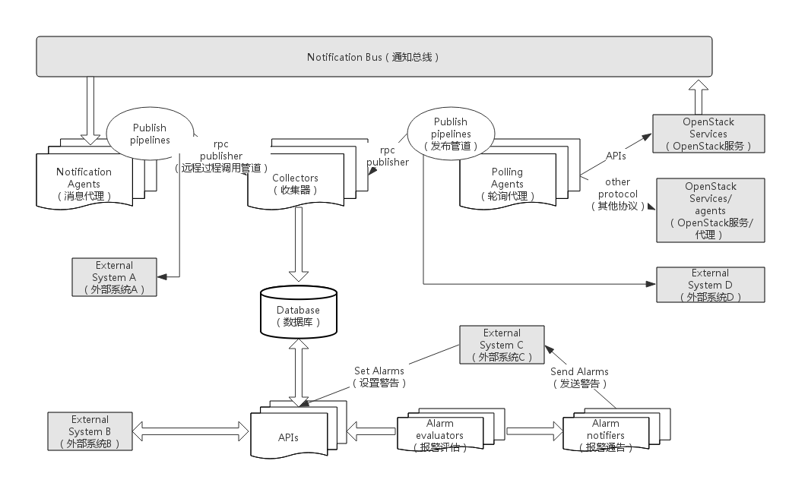

# OpenStack Services

## Keystone

### Keystone 概述
OpenStack的身份管理服务（Identity Service），即Keystone，为OpenStack提供身份认证服务，其作用类似一个服务总线。Keystone中引入令牌机制来管理用户对资源的访问，nova、glance、horizon、swift、以及neutron等服务通过Keystone来进行身份认证，并获得相应操作权限。 
  
   * 身份和访问管理安全：为了有效控制云计算中的用户和服务认证，需要合理定义系统管理人员的控制边界，以防来自内部的攻击所造成的危害。Keystone中通过Policy（访问规则）来做到基于用户角色的访问控制。  
   
Keystone作为OpenStack中的一个独立的提供安全认证的模块，主要负责OpenStack用户的身份认证、令牌管理、提供访问资源的服务目录，以及基于用户角色的访问控制。可以简单的认为一切涉及操作的命令都需经过Keystone的认证，然后才能执行得到相应的结果，以确保操作的安全性。

### Keystone 体系架构

## Horizon

### Horizon 概述
OpenStack的控制面板部件，它是基于Web界面设计的，允许云管理者和云用户管理各种OpenStack资源的服务的部件。其他的服务组件在horizon界面上以按钮形式呈现供用户操作，如用户可以点击horizon上的**Image**按钮来创建一个新的镜像服务，通过**Compute**来访问、控制其计算、存储和网络资源等。
Horizon将页面上的所有元素模块化，表单、表格等一些网页中常见的元素全部被封装成python类，每个这样的组件都有自己对应的一块html模板，渲染整个页面时，Horizon会先找到当前页面包含多少个组件，并将各个组件分别渲染成一段html片段，最后拼接成一个完整的html页面返回给浏览器。
 
### Horizon 网站布局

## Nova

### Nova 概述
OpenStack的计算部件，它是基础设施即服务Iaas的重要组成部分。OpenStack为用户提供创建虚拟机的服务，符合要求的虚拟机的参数如何传递，选取哪个节点来创建新的虚拟机的实例以及主机如何选择等等问题，都是依靠Nova来实现。Nova的主要任务是控制虚拟机的状态迁移与生命周期，以及进行资源的分配。它的工作离不开其他部件的协同，如keystone提供的认证服务；dashboard提供的用户操作面板；glance提供的镜像服务；neutron提供的网络服务等等。  
目前的Nova主要由API、Compute、Conductor以及Scheduler四个核心服务组成，它们之间通过AMQP（Advanced Message Queuing Protocol，高级消息队列协议）进行通信。

### Nova 体系结构

## Neutron

### Neutron 概述
OpenStack的网络部件，它的存在使得独立的虚拟机可以联合使用，主要为其他部件提供网络服务。为用户提供一个API接口，以便在其中定义网络以及它的附加服务。能够为同一物理网络上的每个租户提供独立的虚拟网络环境。它提供一个三层的抽象route与一个二层的抽象network。与真实的网络环境类似，router对应路由器，为用户提供路由、NAT等服务。network对应一个二层局域网，从租户角度看，它为租户私有。

### Neutron 体系架构

## Glance

### Glance 概述
OpenStack提供镜像的部件。它主要提供一个虚拟机镜像的存储、查询和检索服务，通过提供一个虚拟磁盘映像的目录和存储库，为nova的虚拟机提供镜像服务。其本身不负责大量数据的存储，其存储主要依赖swift，主要用swift存储虚拟机的镜像、快照等。

### Glance 体系结构

## Cinder

### Cinder 概述
OpenStack的存储部件之一，为虚拟机提供持久化的块存储能力，实现虚拟机存储卷的创建、挂载卸载、快照等生命周期的管理。它是在虚拟机与具体存储设备之间引入一层“逻辑存储卷”的抽象，它提供的RESTful API主要针对逻辑存储卷的管理。

### Cinder 架构

## Swift

### Swift 概述
OpenStack提供对象存储服务的部件。Swift在存储数据与具体存储设备和文件系统之间引入“对象”的概念作为一层抽象，它提供的RESTful API主要用于对象的访问。其中主要存放更新频率较低的数据，其存储对象是对象而非文件。其他组件如用到swift，需到swift中进行写数据和读数据；swift利用keystone进行认证服务。
	
### Swift 架构
对Object的抽象。

## Heat 

### Heat 概述
OpenStack负责编排计划的主要项目。类似于AWS的CloudFormation，它可以协调配置不同节点的部署顺序和部署内容。Heat基于模版文件实现了一种通过简单定义和配置就能实现的自动化的云部署方式，可以在模版文件中定义所需的各种资源以及各资源之间的依赖关系。Heat会自动分析不同资源之间的依赖关系，从而可以按照先后顺序，依次调用OpenStack不同组件的API来创建资源并搭建运行环境，提供用户所需的业务功能。Heat与Ceilometer一起，可以提供动态扩展的服务。
 
### Heat 与其他组件的联系
Heat是建立在Nova、Neutron等组件之上的一个组件，它充当了OpenStack对外接口的角色，用户不再需要接触OpenStack其他项目，只需把自己对各种资源的需求写在Heat模版里，Heat就会自动调用相关服务的接口来配置资源，从而满足用户的需求。

## Ceilometer

### Ceilometer 概述
OpenStack提供计量与监控的组件。其目标是为OpenStack环境提供一个获取和保存各种测量值的统一框架。通过Ceilometer，OpenStack系统的管理员和用户可以获取和保存包括计量和监控的各种测量值。它设计的最初目的只是为了获取保存计量信息来支持对用户收费；但是由于项目的扩大，它成为OpenStack系统里一个标准的获取保存测量值的框架；后来由于Heat的需求，Ceilometer又增加了利用已保存的测量值进行报警的功能。

### Ceilometer 架构

